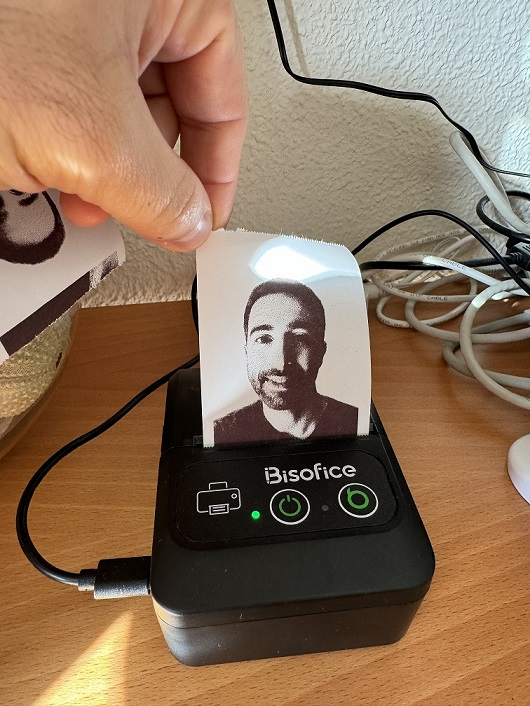
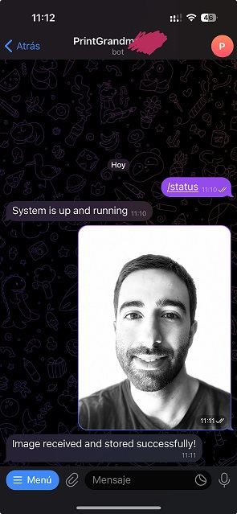

Introduction
============

PrintGrandma is a simple implementation of an automatic thermal printer system for pictures made for my grandmother, inspired by [Yayagram's project](https://github.com/mrcatacroquer/yayagram). You can find more of Yayagram project in [instructables](https://www.instructables.com/Yayagram/).
In my case, the printing is automatic. My grandmother does not know how to read, does not have a smartphone and it has to be the easiest that it could be, so it will not be bydirectional, just one way.
Any of the grandson/grandsister can send a picture to the telegram bot, and it will be printed automatically.

Core functionality
============
- Telegram interface: to receive the pictures and save them for the printing queue.
- Thermal Printer interface: Control the printer

Future functionality
============
- Sound/Light notification.
- Voice message replay

Installing
============
    $ pip install -r requirements.py

Environment variables configuration
============
    Note that at least TELEGRAM_PRINTER_API_KEY and CHAT_ID_USER1 environment variables should be inside /etc/profile file:
    
    $ export TELEGRAM_PRINTER_API_KEY="fadfadffs432432"
    $ export CHAT_ID_USER1="123213123"

Usage
============
    $ sudo -E python printgrandma.py
    #-E to use user environmental variables set in /etc/profile

Getting help or sharing your idea
============
Ask questions by opening a discussion.

License
============
MIT
