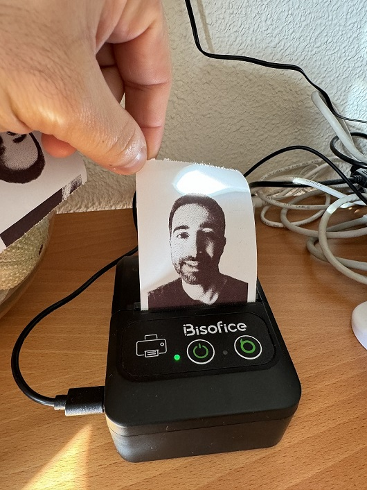
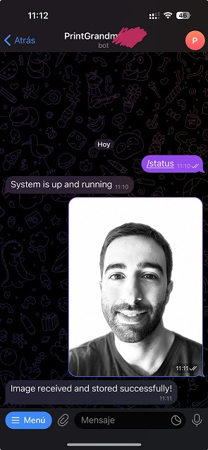

# PrintGrandma

An automatic thermal printer system that receives photos via Telegram and prints them — built for my grandmother, inspired by the [Yayagram project](https://github.com/mrcatacroquer/yayagram) ([Instructables guide](https://www.instructables.com/Yayagram/)).

My grandmother can't read, doesn't own a smartphone, and needs the simplest possible experience: family members send a photo to the Telegram bot, and it prints automatically — no interaction needed on her end.

| Printed result | Telegram bot |
|:-:|:-:|
|  |  |

## Features

- **Telegram bot** — receives photos from authorised family members and queues them for printing.
- **Thermal printer interface** — polls the queue and sends images to a USB ESC/POS thermal printer at the correct width.
- **Multi-process architecture** — the bot and printer run as independent processes; if one crashes the other shuts down cleanly.

## Planned features

- Sound/light notification when a photo arrives.
- Voice message playback.

## Requirements

- Python 3.10–3.13
- [uv](https://docs.astral.sh/uv/) package manager
- A USB ESC/POS thermal printer
- A Telegram bot token (obtain via [@BotFather](https://t.me/botfather))

## Installation

```bash
# Clone the repository
git clone https://github.com/your-user/PrintGrandma.git
cd PrintGrandma

# Install dependencies (creates .venv automatically)
uv sync
```

## Configuration

### Static configuration — `config/config.yaml`

```yaml
telegram_bot:
  enable: true
  api: TELEGRAM_PRINTER_API_KEY   # name of the env var holding the bot token
  image_dir: received_images/
  allowed_users:
    - CHAT_ID_USER1               # name of an env var holding a chat ID

printer:
  enable: true
  image_width: 384                # pixels — match your printer head width
  idVendor: 0x6868
  idProduct: 0x0200
  profile: "Sunmi-V2"
```

### Environment variables

Add the following to `/etc/profile` (or your preferred env file) so `sudo -E` picks them up:

```bash
export TELEGRAM_PRINTER_API_KEY="your-bot-token"
export CHAT_ID_USER1="123456789"
```

Run the helper script to verify everything is set before starting:

```bash
uv run python environmental_variables_check.py
```

## Running

```bash
# sudo -E forwards the user's environment variables to the root process
sudo -E uv run python printgrandma.py

# Optional: point to a custom config file
sudo -E uv run python printgrandma.py --config /path/to/config.yaml
```

## Development

```bash
# Install dev dependencies (ruff is included)
uv sync

# Lint
uv run ruff check .

# Format
uv run ruff format .

# Lint + auto-fix
uv run ruff check --fix .
```

## License

[MIT](LICENSE)
